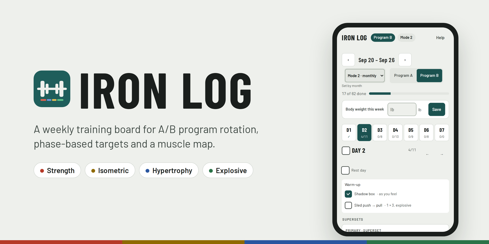
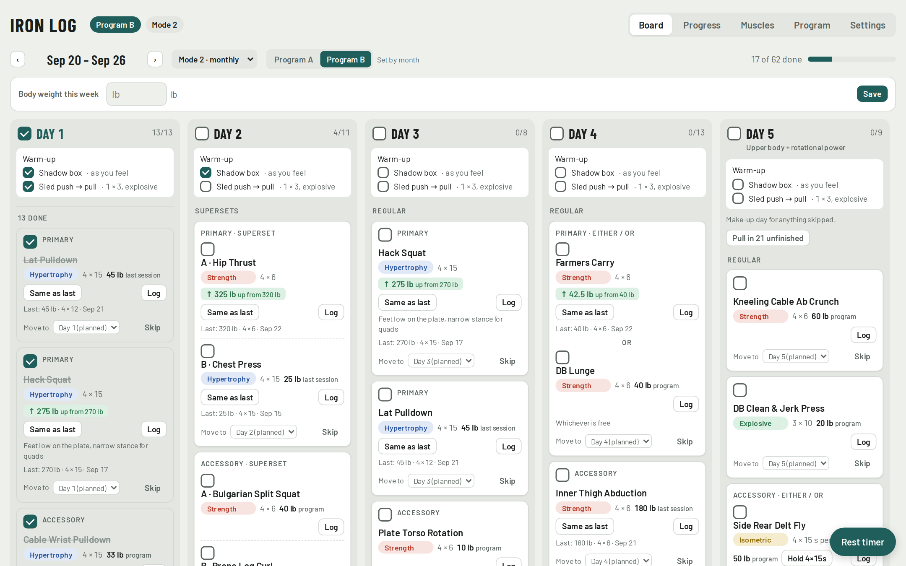
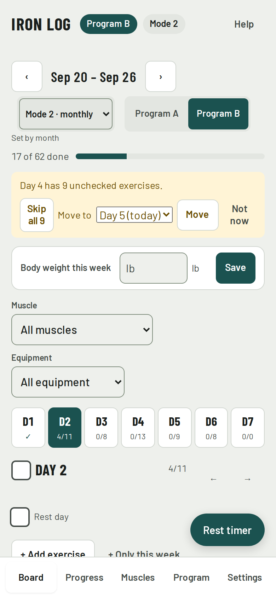
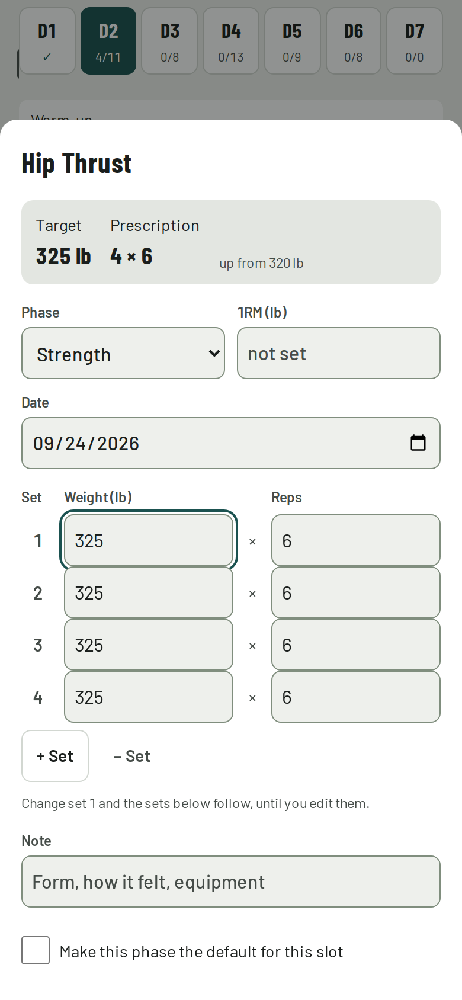
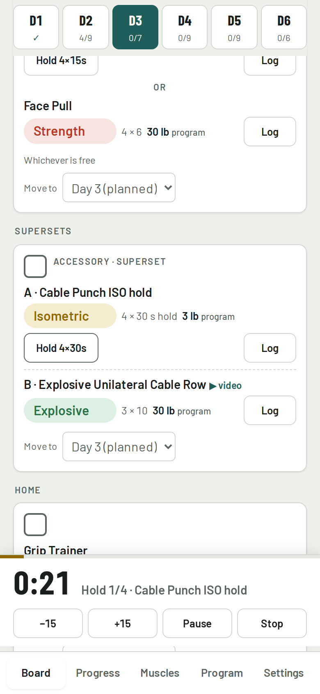
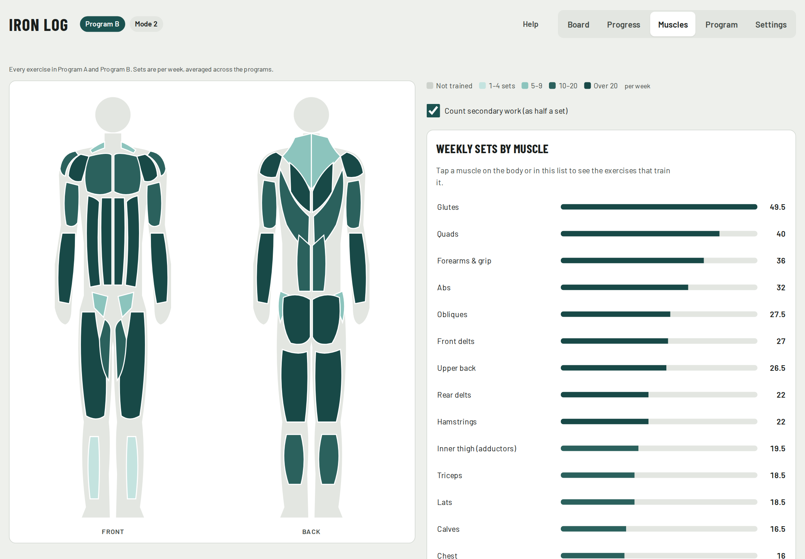
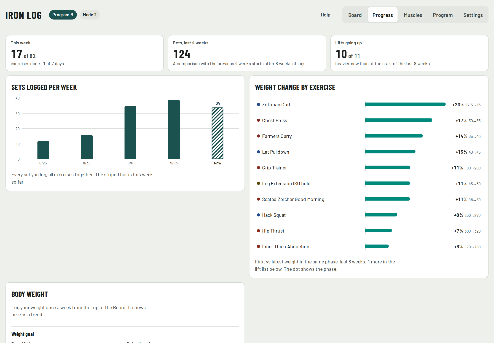
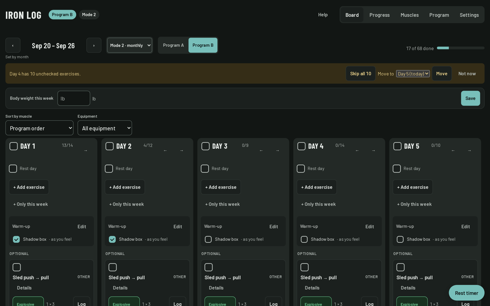
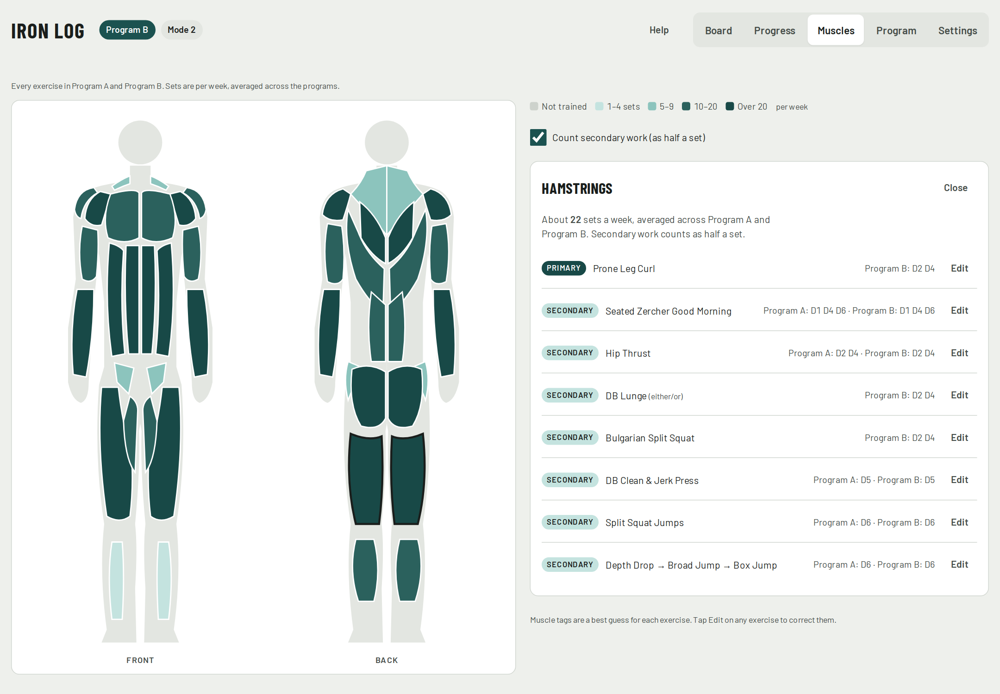
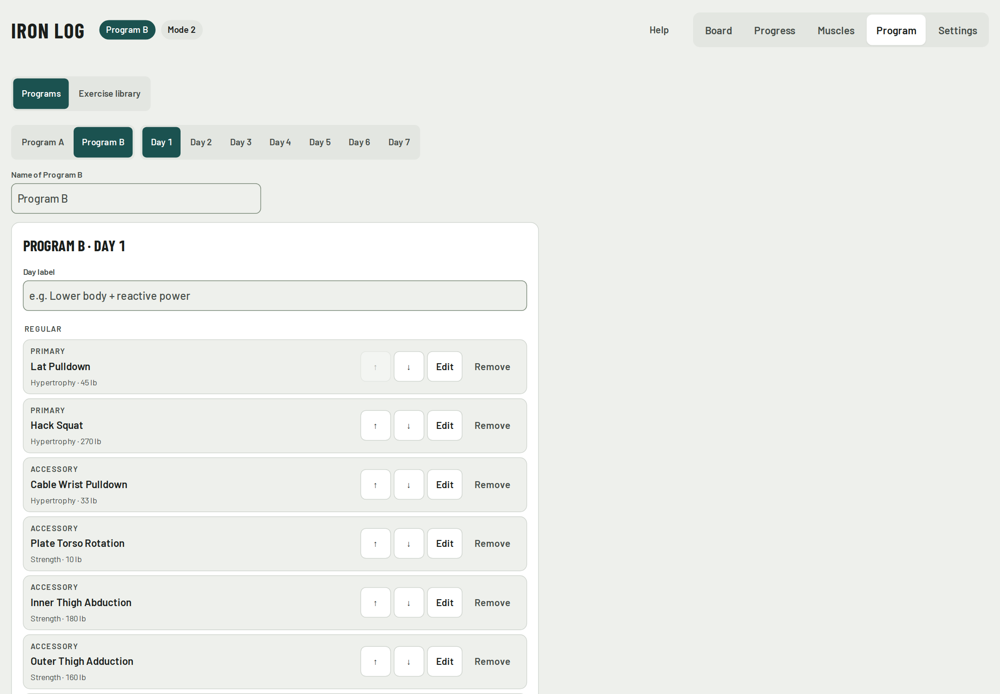

<p align="center">
  
</p>

<p align="center">
  <a href="https://jacgit18.github.io/iron-log/"><b>Open the app</b></a> ·
  <a href="#features">Features</a> ·
  <a href="#screenshots">Screenshots</a> ·
  <a href="#running-it">Running it</a>
</p>

<p align="center">
  <a href="https://jacgit18.github.io/iron-log/"></a>
  
  
  <a href="LICENSE"></a>
</p>

Iron Log is a single-page workout tracker built around a weekly board. It runs two training programs (A and B) on a rotation schedule, sets targets for each exercise by training phase, and shows which muscles a program trains.

It's plain HTML, CSS and JavaScript. There is no build step, no framework and nothing to install.

## Screenshots

<sub>Screenshots use sample data.</sub>



| Phone: one day at a time | Logging a set | Isometric hold timer |
| :---: | :---: | :---: |
|  |  |  |

| Muscle map | Progress |
| :---: | :---: |
|  |  |

<details>
<summary>More: dark mode, muscle detail, program editor</summary>





</details>

## Features

- **Weekly board.** One column per training day (Sunday to Saturday week). You can check off exercises one at a time or a whole day at once. When equipment is taken, drag a card to another day (or use "Move to" on a phone). Day 5 is a make-up day that can pull in anything left unfinished. **Skip** takes an exercise out of this week's counts without deleting it, and checking it off later undoes the skip. Done and skipped exercises drop to the bottom of their day, so what's left is always on top.
- **Program rotation.** There are three modes:
  1. Program A only.
  2. A and B alternate by month (even and odd months), and you can switch any single week by hand.
  3. A and B swap every 6 months.
- **Training phases.** Every exercise is tagged Strength, Isometric, Hypertrophy or Explosive, with a default sets × reps for each. You can change the phase for a single week or save it as the new default.
- **Targets.** Enter a 1-rep max and the target becomes 1RM × the phase's %. Without a 1RM, the target is your last logged weight in that phase.
- **Suggestions to go heavier.** After two separate days in a row with every set completed, the target goes up by +2.5 lb (under 50 lb) or +5 lb. For isometric work, it waits until you've held 30 s on every set.
- **Body weight.** Log it once a week from the top of the board. The Progress tab shows the latest weight, the change over about four weeks and a trend chart, and it's included in the Excel and data exports.
- **Fast logging.** Log weight, sets and reps (or hold seconds for isometrics). A "Same as last" button repeats your previous entry in one tap.
- **Timers.** A hold countdown on isometric exercises that rests between sets and starts the next hold, plus a general rest timer.
- **Progress.** Headline numbers for the week, sets logged per week, weight change by exercise over the last 8 weeks, a muscles-by-week heatmap of what you actually trained, a weight-over-time chart for each exercise (one phase per chart) and a 12-week record of days completed.
- **Excel export.** Download an overall workbook (summary, every session with the muscles it trains, weekly sets per muscle, weekly totals, settings) or a workbook for a single week, or export plain CSV. In the Claude version, **Back up to GitHub** commits the same workbooks to a private repo.
- **Export and import.** One JSON file holds everything: the log, weekly check-offs, programs, saved versions and settings. Import it with **Add to my data** (keeps what's here and fills in what's missing) or **Replace my data** (makes the app match the file).
- **Muscle map.** Front and back body diagrams shaded by weekly sets per muscle group. Tap a muscle to see the exercises that train it. You can edit the muscle tags for any exercise.
- **Program editor.** Add, edit, reorder and remove exercises (single, superset or either/or) for any day of either program. Rename either program; the new name shows everywhere, while A and B still drive the rotation. **Saved versions** keep named copies of a program; the built-in original is always kept, and loading a version saves the current one first so nothing is lost.
- **Works on phones.** On a phone you see one day at a time and swipe between days, with bottom navigation and large tap targets. It follows light and dark mode.

## Running it

- **Hosted:** open **[jacgit18.github.io/iron-log](https://jacgit18.github.io/iron-log/)**.
- **Locally:** open `index.html` in a browser, or serve the folder (`python3 -m http.server`) and open `http://localhost:8000`.

## Where data is stored

Run on its own, the app saves everything in your browser's `localStorage`. That data stays on that device and that browser only, and clearing site data erases it. Use **Export all data** in Settings to keep a backup you can import again.

When it's published as a Claude artifact, it uses the artifact's shared database instead (`window.claude`), so the log follows you across devices. The code checks which of the two is available and picks it at runtime.

The Claude version can also back up to a private GitHub repo through the viewer's GitHub connector. It writes `iron-log.xlsx`, the full `iron-log-data.json` export, plus `weeks/YYYY-MM-DD.xlsx` for each week that changed since the last backup. The Excel library (SheetJS) loads only when you export.

## Project layout

```
index.html                    page markup
styles.css                    all styles (light and dark themes)
js/data.js                    built-in programs, exercises, phases
js/state.js                   dates, settings, storage, helpers
js/render.js                  board, progress, settings and log screens
js/timers.js                  hold and rest timers
js/muscles.js                 muscle map and exercise→muscle tags
js/charts.js                  trend charts on the Progress tab
js/editor.js                  program editor
js/export.js                  Excel export and GitHub backup
js/events.js                  input handling and startup
assets/logo.svg               logo and favicon
tools/screenshots.mjs         generates docs/images/ with sample data
tools/banner.html             README banner template
.github/workflows/            regenerates screenshots on feature branches
```

The scripts are plain (non-module) scripts loaded in order and share one global scope.

## Customizing

The two built-in programs are the `PROGRAM_A` and `PROGRAM_B` objects in `js/data.js`. The default muscle tags are in `MUSCLE_MAP` in `js/muscles.js`. You can also change both from inside the app (the Program tab, and Edit on the Muscles tab), and those changes are saved on top of the built-in defaults.

The phase percentages (Strength 85%, Isometric 75%, Hypertrophy 65%, Explosive 45%) are placeholders. Change them in Settings.

## Development

Changes are made on feature branches and merged into `main` through pull requests. `main` is what GitHub Pages serves.

When a pull request's branch changes the app, the **README screenshots** workflow regenerates `docs/images/` and commits the new images to that branch, so they merge along with the change. To run it locally:

```bash
npm install --no-save playwright
npx playwright install chromium
node tools/screenshots.mjs
```

## Notes

- Muscle tags are approximate, and "weekly sets" counts secondary work as half a set. Treat the muscle map as a rough guide to coverage, not an exact measure.
- This is a personal training log, not medical or coaching advice.

## License

MIT. See [LICENSE](LICENSE).
